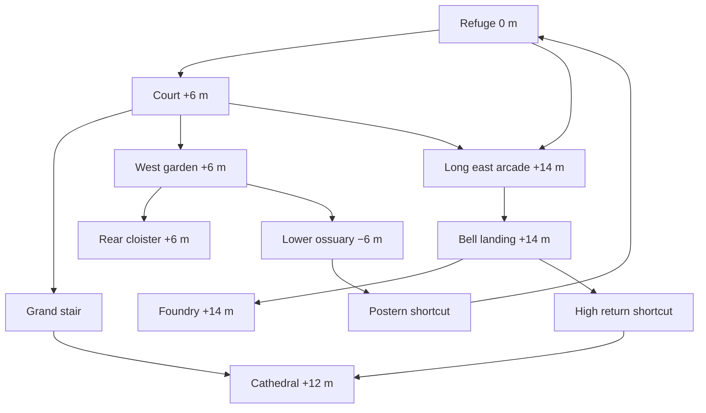

# Ashen Parish: replacement floor plan

Reference: [the approved original concept](concepts/ashen-parish-direction-v1.png).
The earlier scenery replacement retained the old layout and did not satisfy the
request. That layout definition is now removed. The floor engine and ECS remain;
the authored footprint, elevations, routes, architecture, encounters and
interaction placements are new.

The composition follows the image's relationships: refuge in the foreground,
a broad central court above it, burial chambers below the west terrace, an
attached upper grave garden and rear cloister, a long eastern arcade terminating
at a bell landing, a foundry beyond that landing, and a wide ceremonial stair
up to the cathedral.

| Elevation | Space                          | Arrangement                                                             |
| --------- | ------------------------------ | ----------------------------------------------------------------------- |
| −6 m      | Ossuary                        | Broad lower chamber under the west burial terrace; exposed front vaults |
| 0 m       | Refuge                         | Foreground shelf with inward facing houses, chapel and fire             |
| +6 m      | Court and west terrace         | Continuous 64 m-wide plaza and connected garden/cloister                |
| +12 m     | Cathedral vestibule and Warden | Wide stair above the court; boss simulation uses this floor             |
| +14 m     | Bell walk and foundry          | Long straight eastern deck, rear bell landing and foundry               |

The refuge opens directly onto the procession stair. There is no barred gate
on that primary route. The ossuary has a long west descent and a postern return
to the refuge. The east deck has a foreground stair, a mid-court ascent and a
short return to the cathedral. The two optional gates bar the postern and high
return; they open from their far sides. They no longer force the old zigzag
through separate rooms.

`ashenParish.ts` owns the new floors, routes, interaction anchors, cover and
spawns. `parishArchitecture.ts` owns shared architectural footprints.
`parishEnvironment.ts` builds the scene from those definitions. Floors support
stacked planes and slopes; adjacency requires both ends of the shared edge to
match. Architecture uses actual open arch geometry for Rapier collision.
Foundations sit below the lowest floor, so they do not fill the burial chamber
or the passage beneath the east deck. Static scenery batches by spatial cell.

The boss encounter has a ground elevation, defaulting to zero for other uses;
the parish sets it to twelve metres. Leap, recovery, defeat and impact effects
respect that elevation. Live encounters remain in the existing Koota systems.
The return portal, player bounds, checkpoint spawns and map were moved with the
new plan.

Tests cover all-area and reward reachability with gates shut, connected slopes,
new and removed footprints, floor overlaps, navigation around cover, gate
sidedness, shortcut return distance, projectile elevation, actual arch collision,
raised boss movement, batching and disposal. Native player-controller checks
walked from refuge to court at +6 m, climbed the cathedral stair to +12 m,
ascended the long bridge to +14 m and descended the west stairs to −6 m.

Earlier design research remains relevant: [Bramasole's level-design methodology](https://medium.com/@bramasolejm030206/preface-ec08bc1459d0),
[The Level Design Book on verticality](https://book.leveldesignbook.com/process/layout/flow/verticality)
and [Bart Vossen's melee combat design interviews](https://www.gamedeveloper.com/design/level-design-for-melee-combat-systems).

## Atmosphere and inhabited detail

The architecture refinement pass adds six planted stone beds to the court and
cloister, alongside the existing bed, and two court benches. Their masonry,
soil and shrub stems share authored positions; retaining walls and bench legs
sit on the pavement. Bed and bench footprints feed both Rapier and navigation.
The first guard's approach and the statue's east lane remain clear.

Roofs now have individual slate courses seated on their original sloping
prisms, with ridge caps. Refuge houses have corner quoins and foot courses.
The cathedral entrance has layered archivolts and embedded portal shafts,
blind lancets, tower corner masonry, string courses and a stained rose window
with petal tracery. Narrow arcade piers have attached pilasters and capitals;
cloister roofs show supporting ribs, and iron bands articulate the foundry
chimney. Court rings are flat, segmented stone inlays. Planters, pews and
rubble have constructed geometry in place of their former single boxes.

The floor plan, shortcut topology and encounter roster are retained. One
existing guard spawn was inside the cathedral facade; it now sits on the
vestibule pavement at [8, 12, 32]. Contact raycasts check slate support,
facade attachments and shrub roots, while the route suite checks reachability
with gates closed. All new static details enter the existing spatial batches;
shrub leaves use the existing foliage instances and graphics-detail control.

The concept's richness also depends on its small forms and light, which the
initial layout renderer lacked. `parishDressingPlan.ts` places eighteen trees,
nine supply clusters and fourteen braziers. The refuge has a cloth shelter,
crates, barrels, a bench and house lanterns. The burial terrace has urns, carved
grave crosses, candles, ivy, autumn leaves and understory. The foundry has
worktables, supplies, hot fire and chimney smoke. Banners mark the cathedral
and bell walk. The central monument has a folded robe, hood and arms rather
than a straight cone. Carved courses, finials and rubble add broken edges to
the masonry; layered mountain ridges replace the repeated distant cones.

Warm dusk light and cool shadows replace the even sepia wash, with blue burial
flames providing local contrast. A separate parish post-processing profile
sets the exposure, grade and haze. The sky has slow cloud drift.

`parishDressing.ts` instances foliage in spatial cells and joins static props
to the architecture batches. `parishAtmosphere.ts` uses two instanced flame
meshes and two shared particle materials in spatial cells with fixed buffers;
shaders animate wind,
cloth, fire, smoke and embers. The `parish-air` Koota state supplies bounded
game-frame time. Pause stops that clock, and reduced motion stills wind and
light flicker while hiding moving particles. The existing four-point-light
budget limits the nearby illumination. These choices limit added rendering
work; they are not a measured hardware frame-rate result.

Tree trunks and supply piles use the same footprints for Rapier and enemy
navigation. Reachability tests still cover all routes and rewards with gates
closed. Additional tests check instancing/culling bounds, stable particle
buffers, the light budget, reduced motion, ECS ownership and resource cleanup.
The environment is denser and more animated, but remains procedural geometry;
it does not yet reproduce all the sculptural detail of the painted reference.

## Stair repairs and graphics controls

Stair parapets are sheared along their floor plane, with matching Rapier
trimeshes. The west arcade bay at the mid-court stair arrival is open, clearing
the masonry that intersected the slope. High-walk banners have iron masts
anchored at the deck; house cloth uses wall brackets. The bell has a roof beam,
hanger and clapper. Regression raycasts exercise the original screenshot sites.

Menu → Options → Display exposes four saved presets and individual shadow,
AO, bloom, render-scale, resolution-target, foliage and particle controls.
World detail changes decorative instance counts without replacing buffers,
collision or tree trunks. Particle groups have conservative shader-motion
bounds and normal frustum culling; Off hides decorative particles while flames
and combat warnings remain. The dynamic-resolution budget and lighting caches
are ECS-owned. Menu pauses preserve the current adaptive scale.

Parish preparation initializes authored textures, compiles scene materials,
and renders two zero-delta frames for shadow/post targets while gameplay is
held behind a loading overlay. This reduces first-use work; it cannot guarantee
that every future shader variant or driver upload is stall-free. HUD snapshots
are isolated from the main static environment, enemy, boss and player views.
Development frame telemetry samples a fixed ring buffer and computes p95/p99
only on request. See [graphics verification](graphics-performance.md) for
measurement conditions and remaining limits.
